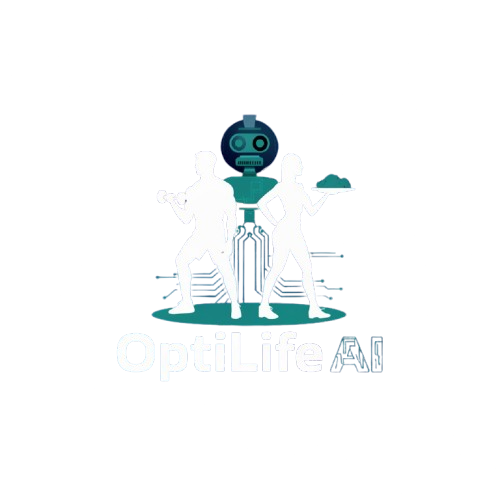

# OptiLifeAI - AI-Powered Fitness Revolution



OptiLifeAI is a comprehensive healthcare and fitness application that leverages artificial intelligence to provide personalized diet and workout plans. Built with modern web technologies, it offers a seamless user experience for achieving optimal health and fitness goals.

## 🚀 Features

- **AI-Powered Personalization**: Advanced AI algorithms create customized diet and workout plans based on user preferences and goals
- **Real-Time Adaptations**: Plans adjust dynamically based on user progress and feedback
- **Nutrition Analysis**: Smart meal tracking with macro optimization and nutritional insights
- **Progress Tracking**: Visual timeline and analytics of your fitness journey
- **Mobile-First Design**: Responsive interface that works seamlessly across all devices
- **Secure Authentication**: JWT-based user authentication with protected routes
- **Cloud Storage**: Image uploads and storage using Cloudinary
- **Rate Limiting**: Built-in protection against API abuse

## 🛠 Tech Stack

### Frontend

- **React 19** - Modern JavaScript library for building user interfaces
- **Tailwind CSS** - Utility-first CSS framework for styling
- **Framer Motion** - Animation library for React
- **React Router DOM** - Declarative routing for React
- **Axios** - HTTP client for API requests
- **React Hook Form** - Performant forms with easy validation
- **React Toastify** - Toast notifications

### Backend

- **Node.js** - JavaScript runtime for server-side development
- **Express.js** - Fast, unopinionated web framework
- **MongoDB** - NoSQL database with Mongoose ODM
- **JWT** - JSON Web Tokens for authentication
- **bcrypt** - Password hashing for security
- **Google Generative AI** - AI-powered content generation
- **Multer** - Middleware for handling file uploads
- **Cloudinary** - Cloud-based image management
- **Express Rate Limit** - Rate limiting middleware

## 📋 Prerequisites

Before running this application, make sure you have the following installed:

- Node.js (v16 or higher)
- npm or yarn
- MongoDB database
- Git

## 🔧 Installation

1. **Clone the repository**

   ```bash
   git clone https://github.com/your-username/HealthCare.git
   cd HealthCare
   ```

2. **Install server dependencies**

   ```bash
   cd server
   npm install
   ```

3. **Install client dependencies**

   ```bash
   cd ../client
   npm install
   ```

4. **Environment Setup**

   Create a `.env` file in the `server` directory with the following variables:

   ```env
   PORT=5000
   MONGODB_URI=your_mongodb_connection_string
   JWT_SECRET=your_jwt_secret_key
   GOOGLE_AI_API_KEY=your_google_ai_api_key
   CLOUDINARY_CLOUD_NAME=your_cloudinary_cloud_name
   CLOUDINARY_API_KEY=your_cloudinary_api_key
   CLOUDINARY_API_SECRET=your_cloudinary_api_secret
   ```

5. **Start the development servers**

   **Server (Backend):**

   ```bash
   cd server
   npm run dev
   ```

   **Client (Frontend):**

   ```bash
   cd client
   npm start
   ```

6. **Access the application**

   Open your browser and navigate to `http://localhost:3000`

## 📖 Usage

### User Registration & Authentication

1. Visit the landing page and click "Get Started"
2. Create an account or log in with existing credentials
3. Complete your profile with personal information

### Creating Plans

1. Navigate to the Dashboard
2. Click "Generate Diet Plan" or "Generate Workout Plan"
3. Fill out the preference form with your goals and constraints
4. Submit to generate your personalized AI-powered plan

### Viewing Plans

1. Access your current plans from the Dashboard
2. View detailed breakdowns of diet and workout recommendations
3. Track your progress over time

## 🔗 API Endpoints

### Authentication Routes

- `POST /api/auth/register` - User registration
- `POST /api/auth/login` - User login
- `POST /api/auth/logout` - User logout

### Plan Routes

- `POST /api/plans/diet` - Generate diet plan
- `POST /api/plans/workout` - Generate workout plan
- `GET /api/plans/diet/current` - Get current diet plan
- `GET /api/plans/workout/current` - Get current workout plan

### Profile Routes

- `GET /api/profile` - Get user profile
- `PUT /api/profile` - Update user profile
- `DELETE /api/profile` - Delete user account

## 🏗 Project Structure

```
HealthCare/
├── client/                 # React frontend
│   ├── public/            # Static assets
│   ├── src/
│   │   ├── components/    # React components
│   │   │   ├── Auth/      # Authentication components
│   │   │   ├── Dashboard/ # Dashboard components
│   │   │   └── ...        # Other UI components
│   │   ├── hooks/         # Custom React hooks
│   │   ├── services/      # API service functions
│   │   └── utils/         # Utility functions
│   └── package.json
├── server/                 # Node.js backend
│   ├── src/
│   │   ├── config/        # Database and service configs
│   │   ├── controllers/   # Route controllers
│   │   ├── middlewares/   # Express middlewares
│   │   ├── models/        # MongoDB models
│   │   ├── routes/        # API routes
│   │   └── utils/         # Utility functions
│   └── package.json
└── README.md
```

## 🤝 Contributing

We welcome contributions! Please follow these steps:

1. Fork the repository
2. Create a feature branch (`git checkout -b feature/AmazingFeature`)
3. Commit your changes (`git commit -m 'Add some AmazingFeature'`)
4. Push to the branch (`git push origin feature/AmazingFeature`)
5. Open a Pull Request

## 📄 License

This project is licensed under the ISC License - see the [LICENSE](LICENSE) file for details.

## 👨‍💻 Author

**Kaif-Vahid**

- GitHub: [your-github-profile](https://github.com/your-username)

## 🙏 Acknowledgments

- Google Generative AI for powering the AI features
- React community for the amazing ecosystem
- All contributors and users of OptiLifeAI

---

**Note**: This application is for educational and personal use. Always consult with healthcare professionals before making significant changes to your diet or exercise routine.
